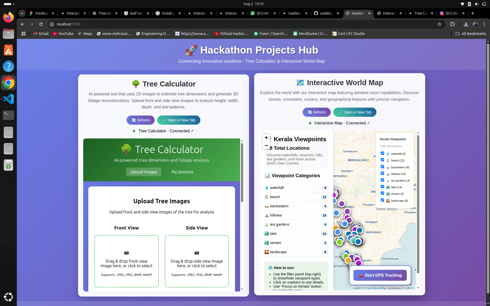
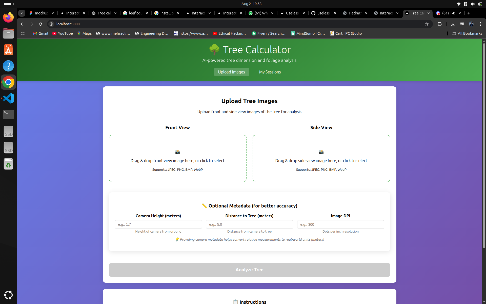
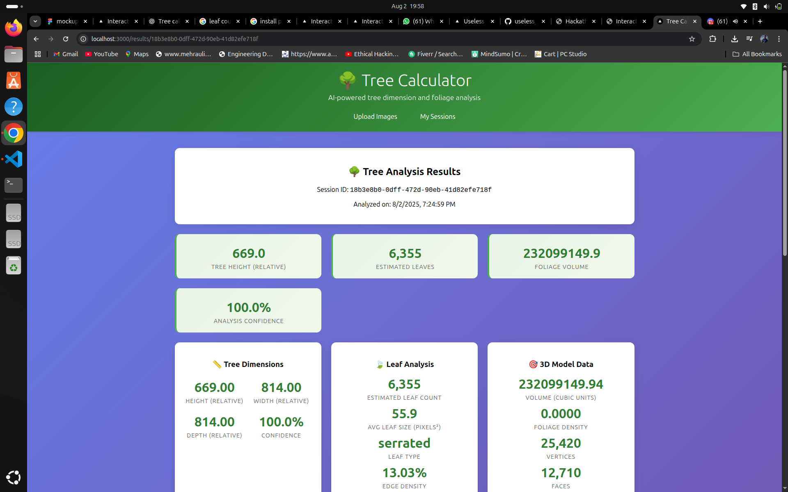
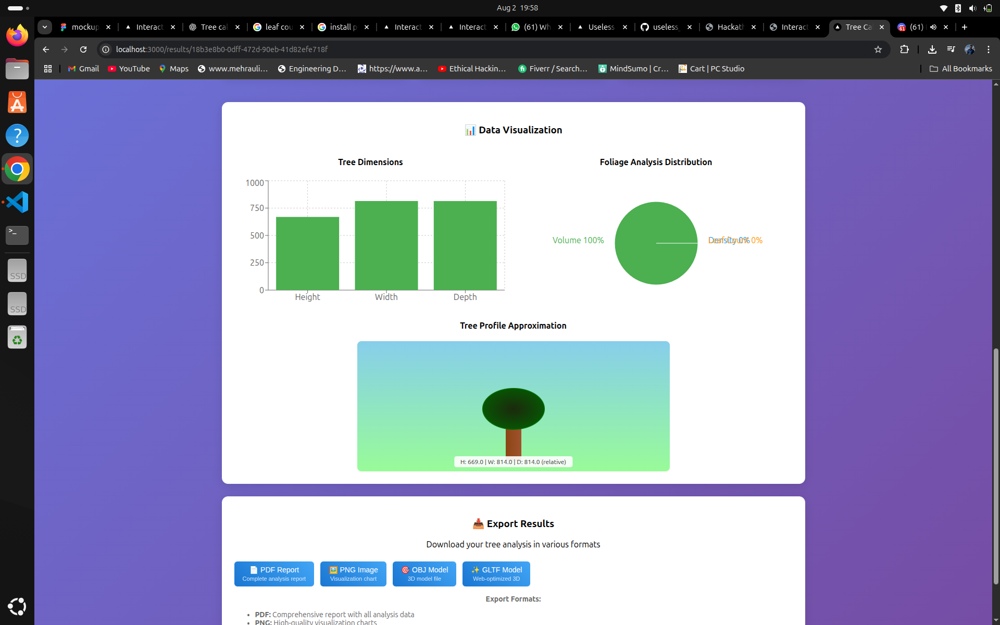
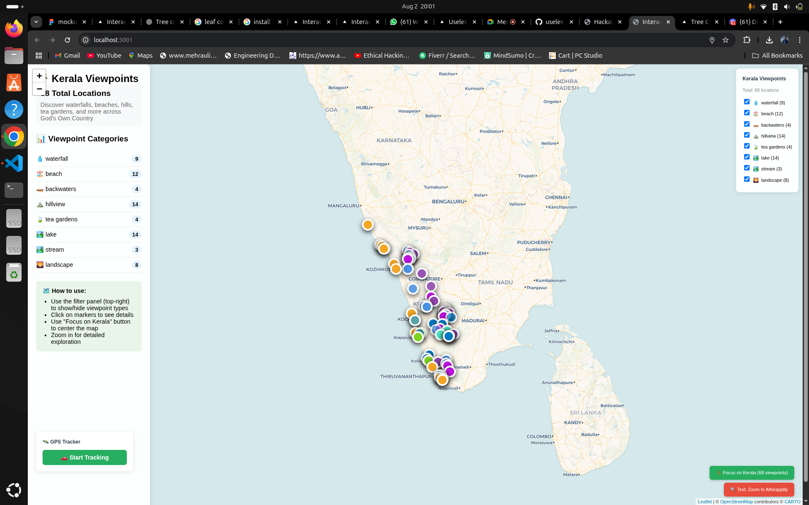
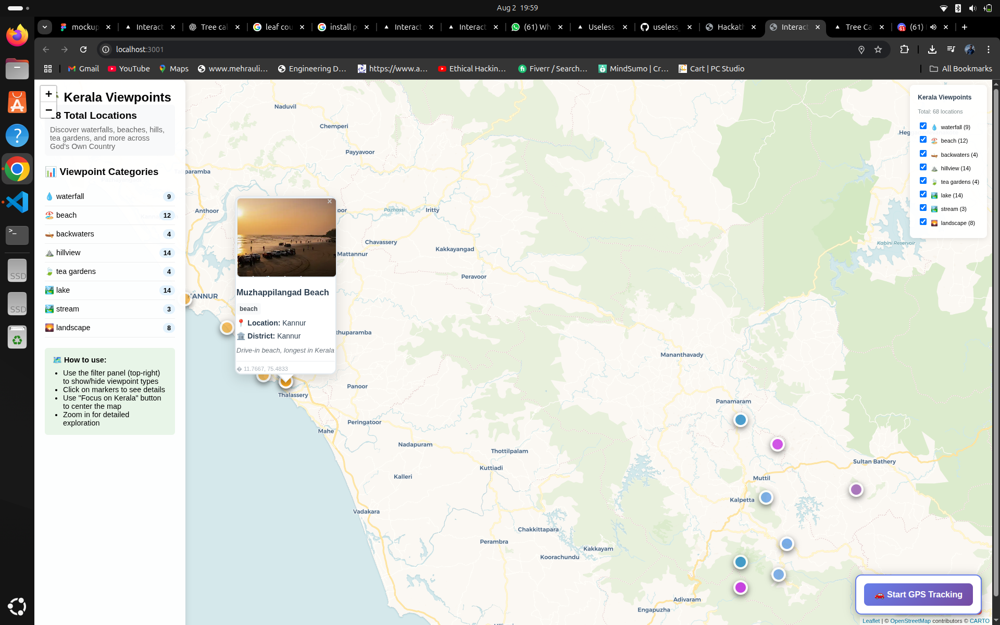

# ViewPoint Leaf Counter: Double Trouble Solutions 🗺️�


## Basic Details
### Team Name: No Mercy


### Team Members
- Team Lead: Gifty K Abharam - Mar Baselios Christian College of Engineering and Technology
- Member 2: Justine  - Mar Baselios Christian College of Engineering and Technology

### Project Description
A dual-interface project that combines an interactive map for notifying users of scenic viewpoints (left/right side of road) with a machine learning model to estimate the approximate number of leaves on a tree using two images from different angles. Designed for travelers, environmental enthusiasts, and researchers to enhance real-time interaction with nature and perform ecological analysis with ease.

### The Problem (that doesn't exist)
1. Missing Beautiful Views on Road Trips?
While driving, people often pass by amazing spots like hills, rivers, and backwaters without noticing whether they’re on the left or right side. There’s no simple system that alerts travelers about these viewpoints in real-time.

2. Counting Tree Leaves is a Headache!
Counting leaves on a tree is important for research, but doing it by hand is super tiring and current digital methods are too complex. A quick and easy way to estimate leaf count using just a couple of photos doesn’t exist.

### The Solution (that nobody asked for)
1. Interactive Viewpoint Notifier 🗺️
A smart map that tells you in real-time if a hill, mountain, river, or backwater is coming up on your left or right side while you drive. No more missing out on scenic spots! You’ll get pop-up or voice alerts to keep you aware and engaged with your surroundings.

2. Easy Tree Leaf Counter 🌿📸
A cool AI model where you just need to click 2 photos of a tree from different angles, and it will estimate how many leaves are on it. No manual counting, no fancy equipment—just your phone and a smart algorithm doing the work for you!


## Technical Details
### Technologies/Components Used
For Software for Tree leaf counter:
- **Languages**: Python, JavaScript, Node.js
- **Frameworks**: FastAPI, React.js, Next.js
- **Python Libraries**: Pillow, OpenCV-python, NumPy, PyTorch, Scikit-learn, Requests, SciPy  
- **JS Libraries**: Axios, React, Recharts, Html2Canvas, File-saver

For Software for interactive map:
- **Languages**: JavaScript, TypeScript
- **Libraries**: GeoJSON, Axios, React, React-DOM, Cheerio, Leaflet
- **Mapping Framework**: React-Leaflet for interactive map rendering


### Implementation
For Software:

#### Installation
```bash
# Prerequisites: Make sure you have Node.js and Python installed
# Take 3 terminals for parallel setup

# Terminal 1 - Interactive Map Setup
cd maps
npm install

# Terminal 2 - Tree Counter Frontend Setup
cd leavescounter/frontend
npm install

# Terminal 3 - Tree Counter Backend Setup
cd leavescounter/backend
python3 -m venv venv
pip install -r requirements.txt
```

#### Run
```bash
# Terminal 1 - Start Interactive Map (Port 3001)
cd maps
npm start

# Terminal 2 - Start Tree Counter Frontend (Port 3000)
cd leavescounter/frontend
npm start

# Terminal 3 - Start Tree Counter Backend (Port 8000)
cd leavescounter/backend
source venv/bin/activate
python main.py

# Open the unified dashboard
# Open index.html in your browser or serve it locally
```

### Project Documentation
For Software:

#### Screenshots (Add at least 3)













### Project Demo
#### Video


https://github.com/user-attachments/assets/97a3680a-2cd9-4c74-8ac9-433da9c27c37


#### Additional Demos
- **Live Interactive Map**: Navigate through scenic locations with real-time left/right notifications
- **Tree Analysis Demo**: Upload sample tree images to see AI-powered leaf count estimation
- **Unified Interface**: Experience both applications working together in the integrated dashboard

## Team Contributions
- **Gifty K Abharam**: Developed the interactive map interface with scenic viewpoint detection, implemented React-Leaflet integration, created the unified dashboard UI/UX, and handled frontend optimization for both applications

- **Justine**:  Led the tree leaf counter development with AI/ML model implementation, FastAPI backend architecture, computer vision algorithms using OpenCV and PyTorch, and overall project coordination

---
Made with ❤️ at TinkerHub Useless Projects 


